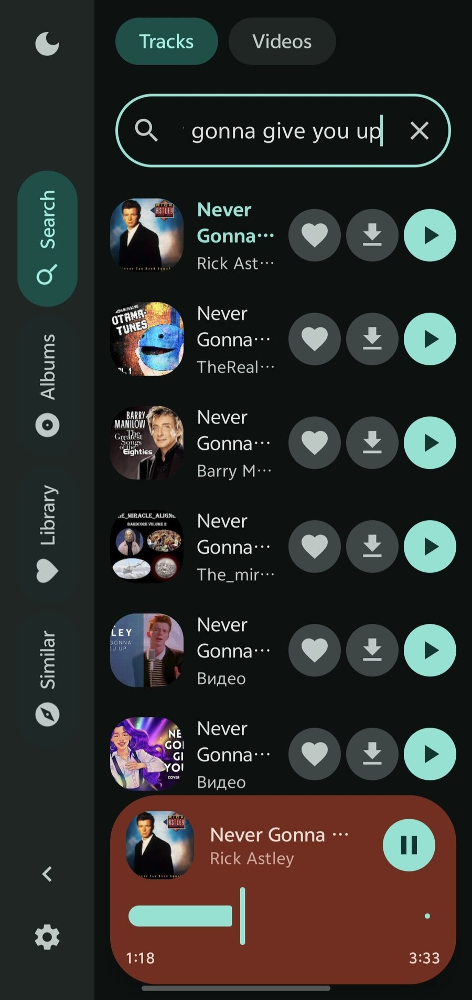
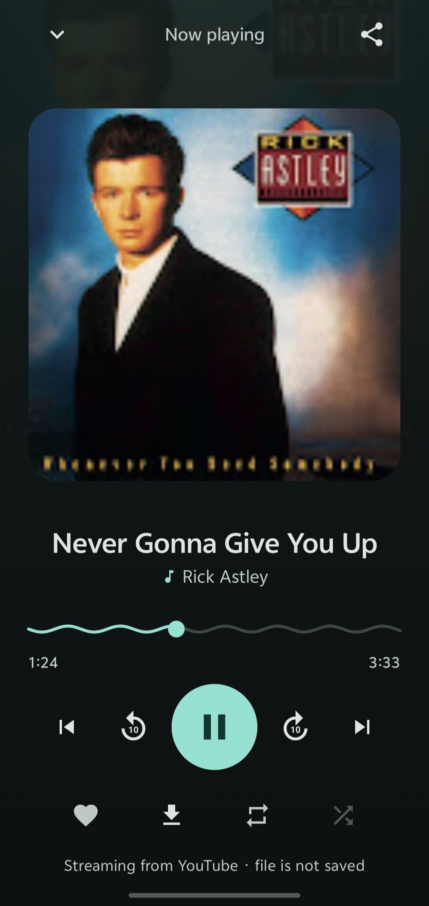
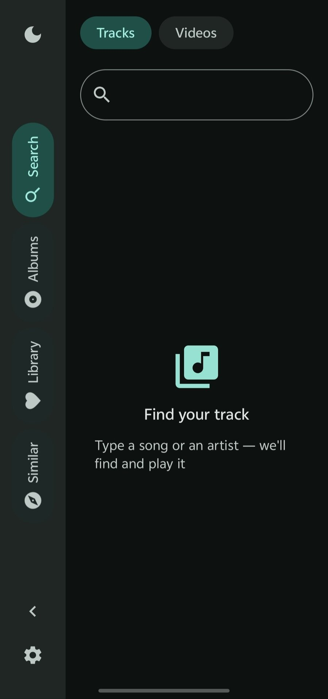

[English](README.md) · [Русский](README.ru.md) · [Українська](README.uk.md) · [Беларуская](README.be.md) · [Français](README.fr.md) · [Español](README.es.md) · [中文](README.zh.md) · [العربية](README.ar.md)

<p align="center">
  
</p>

# Volna

**VIBECODED**

مشغّل موسيقى هادئ لأندرويد. يبحث في **YouTube Music** ويبث الصوت مباشرة — بلا
تنزيل الملف كاملًا، وبلا إعلانات، وبلا حساب.

## لقطات الشاشة

<table dir="rtl">
  <tr>
  <td width="50%" valign="top">
    
    <p align="center"><sub>أغنيات مشابهة</sub></p>
  </td>
  <td width="50%" valign="top">
    
    <p align="center"><sub>بحث، داكن</sub></p>
  </td>
  </tr>
  <tr>
  <td width="50%" valign="top">
    
    <p align="center"><sub>قيد التشغيل</sub></p>
  </td>
  <td width="50%" valign="top">
    
    <p align="center"><sub>الفنان</sub></p>
  </td>
  </tr>
  <tr>
  <td width="50%" valign="top">
    
    <p align="center"><sub>فارغ</sub></p>
  </td>
  </tr>
</table>

## ما الذي يفعله

- **البحث في YouTube Music** — المقاطع الرسمية تحمل اسم الفنان والألبوم في
  العنوان الفرعي، فتبقى الميكسات الطويلة والبثّات بعيدًا عن النتائج.
- **البحث في الفيديو كبديل** — إذا لم يتوفّر المقطع في فهرس YouTube Music،
  فالتطبيق يخبرك بذلك ويبحث في YouTube العادي بدل أن يشغّل شيئًا آخر بصمت.
- **بث مباشر** — يقرأ ExoPlayer دفّق الصوت عبر HTTP مع استئناف، دون تنزيل
  أي ملف كامل.
- **إعادة اتصال تلقائية** — رابط YouTube مرتبط بعنوانك وينتهي صلاحيته، فعند
  الخطأ 403 يطلب التطبيق رابطًا جديدًا بنفسه.
- **قائمة الانتظار** — تُحلّ المقاطع التالية أثناء الاستماع.
- **الألبومات والفنانون** — الفهرس من واجهة iTunes العامة.
- **مقاطع مشابهة** — إذاع مبني على توصيات YouTube Music.
- **مكتبتك** — المقاطع المفضلة وقوائمك الخاصة، قابلة لإعادة الترتيب، محفوظة على
  الجهاز.
- **تشغيل كل أغاني الفنان** — قائمة واحدة مخلوطة من كل ألبوماته.
- **دون اتصال** — التنزيل إلى مجلد `Music/Volna` المشترك.
- **سمة داكنة وفاتحة**، Material 3 Expressive.
- **ثماني لغات** — الإنجليزية والروسية والأوكرانية والبيلاروسية والفرنسية
  والإسبانية والصينية والعربية.

## كيف يعمل

يمرّ البحث عبر واجهة InnerTube الداخلية — نفسها المستخدمة في التطبيق الرسمي،
لكن دون مفاتيح ودون كابتشا:

```
POST https://music.youtube.com/youtubei/v1/search   عميل WEB_REMIX
```

يضع YouTube Music نوعًا لكل نتيجة (`Song` أو `Video` أو `Album` أو
`Playlist` أو `Podcast`) ويعيد `videoId` داخل `playlistItemData` مباشرة. هذا
الفحص للنوع وحده هو ما يفصل المقاطع الرسمية عن غيرها؛ البحث في YouTube العادي
لا يحمل هذه الوسوم، ولهذا تتسرّب المقاطع المصوّرة والريمكسات.

في اختيار الأنسب يُرجَّح اسم الفنان على عنوان المقطع. لولا ذلك لفاز مقطع
«Atlantida [CLIP]» بنسخ من المعجبين بالمقطع الأصلي: العنوان يطابق تمامًا بينما
الفنان لا يطابق. وتُستبعد النسخ المعدّلة (`slowed` و`reverb` و`remix` و
`cover` و`nightcore`) إلا إذا طلبت ذلك الريمكس باسمه.

دفّق الصوت لا يُقدَّم إلا لعملاء InnerTube العاديين، لذا فإن جلب الرابط خطوة
منفصلة، على `www.youtube.com`، بالعملاء `ANDROID` ثم `ANDROID_VR` ثم `IOS`.

## البناء

يحتاج JDK 17 وحزمة Android SDK (compileSdk 35).

```bash
./gradlew :app:assembleDebug          # نسخة تصحيح
./gradlew :app:assembleRelease        # نسخة إصدار
./gradlew :app:testDebugUnitTest      # اختبارات الوحدة
```

تُنسخ كل نسخة إصدار إلى `dist/`، فلا تدهس نسخةٌ أخرى:

```
dist/volna-1.0-release.apk             النسخة العادية، com.volna.player
dist/volna-1.0-FOR_ISLAND-<pkg>.apk    نسخة الجزيرة الديناميكية، انظر أدناه
```

لا تستخدم `app/build/outputs/apk/release`: فهي مجلد عمل يُستبدل محتواه مع كل
بناء، فقد تجد الملف هناك من نسخة أخرى.

### توقيع الإصدار

مفتاح التوقيع موجود بجانب المشروع لكنه لا يدخل في git، ويشير إليه ملف
`keystore.properties`:

```properties
storeFile=volna-release.jks
storePassword=<كلمة مرور المخزن>
keyAlias=volna
keyPassword=<كلمة مرور المفتاح>
```

كلاهما في `.gitignore`. لإنشاء مفتاحك:

```bash
keytool -genkeypair -v -keystore volna-release.jks \
  -keyalg RSA -keysize 4096 -validity 10000 -alias volna
```

من دون `keystore.properties` يظل البناء ناجحًا وينتج ملفًا غير موقّع.

يشمل التوقيع مخططات v1 وv2 وv3: تغطي v2 أندرويد 7+، وv3 هي ما يتيح التحديث
فوق نسخة مثبّتة على أندرويد 11+.

> **المفتاح في هذا المستودع مفتاح تجريبي وكلمة مروره معلنة.** استبدله بمفتاحك
> واحفظه في سرّية: فقدان المفتاح يعني عدم القدرة على إصدار تحديث بالهوية نفسها،
> وتسريبه يتيح لشخص آخر التوقيع باسمك.

## بنية المشروع

```
app/                      التطبيق (Compose، Material 3)
  search/                 InnerTube: YouTubeMusicSearch + بديل YouTubeSearch
  stream/                 جلب رابط الصوت والتحقق منه
  player/                 MediaSessionService فوق ExoPlayer
  catalog/                الألبومات والفنانون عبر iTunes
  library/                المفضلة وقوائم التشغيل
  download/               التنزيل دون اتصال
ytdl/                     مكتبة جلب الدفق (Java خالصة، بلا اعتماديات)
design/                   أشكال الأيقونة
```

الحزم: `com.volna.player` للتطبيق، و`com.ytdl.core` للمكتبة.

## الاختبارات

مُحلّل استجابات InnerTube مغطّى باختبارات وحدة تُنفَّذ على استجابات حقيقية من
الواجهة، وعيّناتها في `app/src/test/resources`. يهمّ ذلك لأن يوتيوب يغيّر تنسيق
الإخراج دوريًا، وبدونها سيبدو تغيير التنسيق مجرد «البحث لم يعد يجد شيئًا».

## نسخة FOR_ISLAND

بعض واجهات الهواتف (vivo/OriginOS وغيرها من الأنظمة الصينية) لا تعرض مشغّلها
العائم الموسّع إلا للحزم الموجودة في قائمة ثابتة. إن كان هاتفك من هذه، فإن
البناء باسم حزمة مختلف يحل المشكلة:

```bash
./gradlew assembleRelease -PforIslandPackage=com.tencent.qqmusic
```

لا يتغيّر سوى `applicationId` — أي اسم الحزمة على الجهاز. أما الشيفرة و
`namespace` وكل ما عداها فيبقى كما هو، فلا تتأثر النسخة العادية.

تذكّر:

- هذا حلّ مؤقت لأنظمة بعينها، لا حلّ عام.
- ملف APK بهذا الشكل يشغل اسم حزمة شخص آخر، فلا يمكن تثبيته مع الأصل، وستحتاج
  إلى إزالة الأصل أولًا.
- تظهر علامة `FOR_ISLAND` والسبب في `versionName` لتُمييز النسخة في قائمة الحزم.
- اسم الحزمة العادي هو `com.volna.player` ولا يتغيّر أبدًا.

## تنويه

التطبيق لا ينزّل الموسيقى: يبثّ الدفّق الصوتي كما يفعل أي مشغّل شبكي. لا
تُكتب الملفات إلا عند الضغط الصريح على زر التنزيل. استخدمه على مسؤوليتك
الخاصة، ووفقًا لـ
[شروط خدمة يوتيوب](https://www.youtube.com/t/terms).

## الترخيص

MIT — راجع [LICENSE](LICENSE).
