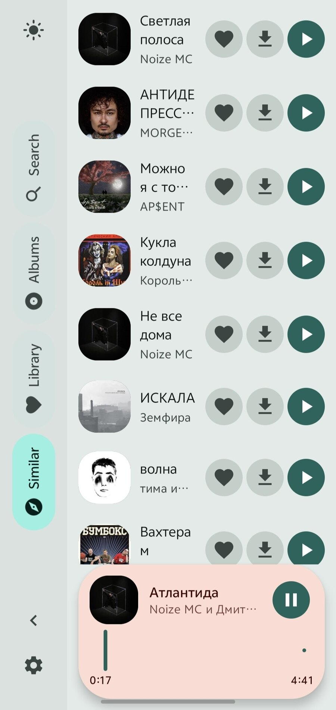

[English](README.md) · [Русский](README.ru.md) · [Українська](README.uk.md) · [Беларуская](README.be.md) · [Français](README.fr.md) · [Español](README.es.md) · [中文](README.zh.md) · [العربية](README.ar.md)

<p align="center">
  
</p>

# Volna

**VIBECODED**

Un lecteur de musique apaisant pour Android. Il cherche dans **YouTube Music**
et lit l'audio en direct — sans téléchargement complet, sans pub, sans compte.

## Captures d'écran

<table>
  <tr>
  <td width="50%" valign="top">
    
    <p align="center"><sub>Recherche</sub></p>
  </td>
  <td width="50%" valign="top">
    
    <p align="center"><sub>Recherche, sombre</sub></p>
  </td>
  </tr>
  <tr>
  <td width="50%" valign="top">
    
    <p align="center"><sub>En cours</sub></p>
  </td>
  <td width="50%" valign="top">
    
    <p align="center"><sub>Médiathèque</sub></p>
  </td>
  </tr>
  <tr>
  <td width="50%" valign="top">
    
    <p align="center"><sub>Artiste</sub></p>
  </td>
  <td width="50%" valign="top">
    
    <p align="center"><sub>Vide</sub></p>
  </td>
  </tr>
</table>

## Ce qu'il fait

- **Recherche dans YouTube Music** — les titres officiels affichent l'artiste et
  l'album, donc les mixes d'une heure et les streams restent hors des résultats.
- **Recherche vidéo en secours** — si le titre manque au catalogue YouTube Music,
  l'application le dit et le cherche sur YouTube, au lieu de jouer autre chose en
  silence.
- **Lecture en direct** — ExoPlayer lit le flux audio en HTTP avec reprise, sans
  rien télécharger entièrement.
- **Reconnexion automatique** — un lien YouTube est lié à votre IP et expire :
  sur un 403 l'application en récupère un neuf toute seule.
- **File d'attente** — les titres suivants se résolvent pendant l'écoute.
- **Albums et artistes** — catalogue via l'API publique iTunes.
- **Titres similaires** — radio fondée sur les recommandations YouTube Music.
- **Votre bibliothèque** — favoris et vos propres playlists, réordonnables,
  stockés sur l'appareil.
- **Tout écouter par artiste** — un ensemble mélangé sur tous ses albums.
- **Hors ligne** — téléchargement vers le dossier partagé `Music/Volna`.
- **Thèmes clair et sombre**, Material 3 Expressive.
- **Huit langues** — anglais, russe, ukrainien, biélorusse, français, espagnol,
  chinois, arabe.

## Comment ça marche

La recherche passe par l'API interne InnerTube — celle de l'application
officielle, sans clés ni captcha :

```
POST https://music.youtube.com/youtubei/v1/search   client WEB_REMIX
```

YouTube Music balise chaque résultat par un type (`Song`, `Video`, `Album`,
`Playlist`, `Podcast`) et renvoie le `videoId` dans `playlistItemData`. Cette
seule vérification de type sépare les titres officiels du reste : la recherche
YouTube classique n'a pas ce balisage, d'où les clips et les remixes.

Le choix du meilleur résultat privilégie l'artiste sur le titre. Sans cela, un
reupload « Atlantida [CLIP] » l'emporterait sur le vrai titre : le nom
correspond parfaitement, l'artiste non. Les versions (`slowed`, `reverb`,
`remix`, `cover`, `nightcore`) sont écartées sauf si le remix est demandé par son
nom.

Le flux audio n'est servi qu'aux clients InnerTube classiques, donc la
résolution du lien se fait à part, sur `www.youtube.com`, avec les clients
`ANDROID`, `ANDROID_VR` puis `IOS`.

## Compilation

JDK 17 et le SDK Android (compileSdk 35) sont requis.

```bash
./gradlew :app:assembleDebug          # APK de debug
./gradlew :app:assembleRelease        # APK de release
./gradlew :app:testDebugUnitTest      # tests unitaires
```

Chaque build de release est copié dans `dist/`, donc les builds ne s'écrasent pas :

```
dist/volna-1.0-release.apk             build normal, com.volna.player
dist/volna-1.0-FOR_ISLAND-<pkg>.apk    variante îlot dynamique, voir plus bas
```

N'utilisez pas `app/build/outputs/apk/release` : c'est un dossier de travail
écrasé à chaque build, le fichier présent peut être une autre variante.

### Signature de la release

La clé est à côté du projet mais n'entre pas dans git ; c'est
`keystore.properties` qui pointe dessus :

```properties
storeFile=volna-release.jks
storePassword=<mot de passe du keystore>
keyAlias=volna
keyPassword=<mot de passe de la clé>
```

Les deux fichiers sont dans `.gitignore`. Pour créer votre clé :

```bash
keytool -genkeypair -v -keystore volna-release.jks \
  -keyalg RSA -keysize 4096 -validity 10000 -alias volna
```

Sans `keystore.properties` la compilation réussit et produit un APK non signé.

La signature active v1, v2 et v3 : v2 couvre Android 7+, v3 permet de mettre à
jour par-dessus une installation existante sur Android 11+.

> **La clé de ce dépôt est une clé de test, son mot de passe est public.**
> Remplacez-la par la vôtre et gardez-la secrète : une clé perdue empêche de
> publier une mise à jour sous la même identité, une clé divulguée permet à
> quelqu'un d'autre de signer à votre place.

## Structure

```
app/                      l'application (Compose, Material 3)
  search/                 InnerTube : YouTubeMusicSearch + secours YouTubeSearch
  stream/                 résolution et vérification du lien audio
  player/                 MediaSessionService sur ExoPlayer
  catalog/                albums et artistes via iTunes
  library/                favoris et playlists
  download/               téléchargements hors ligne
ytdl/                     bibliothèque de résolution (Java pur, sans dépendances)
design/                   variantes d'icône
```

Paquets : `com.volna.player` pour l'application, `com.ytdl.core` pour la
bibliothèque.

## Tests

Le parseur de réponses InnerTube est couvert par des tests unitaires exécutés
sur de vraies réponses d'API — les fixtures sont dans
`app/src/test/resources`. YouTube change périodiquement son balisage, et sans
elles un changement de mise en page ressemblerait à « la recherche ne trouve
plus rien ».

## La variante FOR_ISLAND

Certaines interfaces (vivo/OriginOS et autres ROM chinoises) n'affichent leur
lecteur flottant-développé que pour les paquets d'une liste figée. Si votre
téléphone est de ceux-là, compiler avec un autre nom de paquet règle le
problème :

```bash
./gradlew assembleRelease -PforIslandPackage=com.tencent.qqmusic
```

Seul l'`applicationId` change — le nom de paquet sur l'appareil. Le code, le
`namespace` et tout le reste restent inchangés, le build normal n'est pas
affecté.

À garder en tête :

- C'est un contournement pour des interfaces précises, pas une solution
  universelle.
- Un tel APK occupe le nom de paquet d'un autre : impossible à installer à côté
  de l'original, il faut le retirer.
- L'étiquette `FOR_ISLAND` et la raison apparaissent dans `versionName`.
- Le paquet normal est `com.volna.player` et ne change jamais.

## Avertissement

L'application ne télécharge pas de musique : elle lit le flux audio, comme
n'importe quel lecteur réseau. Les fichiers ne sont écrits que sur appui
explicite sur Télécharger. À utiliser à vos risques, conformément aux
[conditions de YouTube](https://www.youtube.com/t/terms).

## Licence

MIT — voir [LICENSE](LICENSE).
