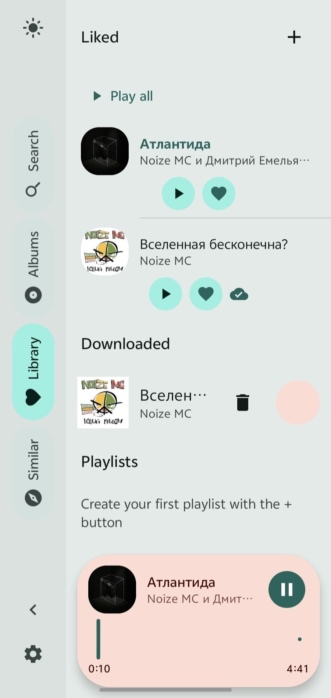
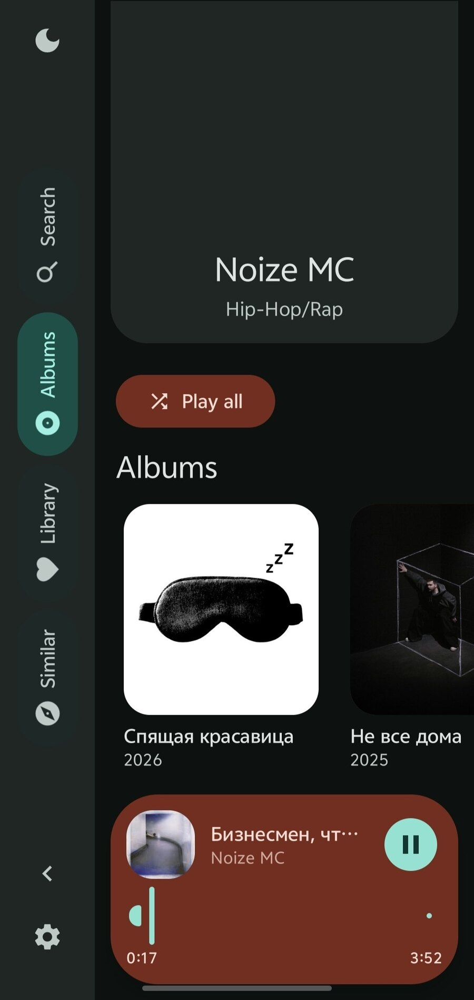

[English](README.md) · [Русский](README.ru.md) · [Українська](README.uk.md) · [Беларуская](README.be.md) · [Français](README.fr.md) · [Español](README.es.md) · [中文](README.zh.md) · [العربية](README.ar.md)

<p align="center">
  
</p>

# Volna

**VIBECODED**

一款安静的 Android 音乐播放器。它在 **YouTube Music** 中搜索并直接串流音频 ——
不整首下载，没有广告，也不需要账号。

## 截图

<table>
  <tr>
  <td width="50%" valign="top">
    
    <p align="center"><sub>相似歌曲</sub></p>
  </td>
  <td width="50%" valign="top">
    
    <p align="center"><sub>搜索，深色</sub></p>
  </td>
  </tr>
  <tr>
  <td width="50%" valign="top">
    
    <p align="center"><sub>正在播放</sub></p>
  </td>
  <td width="50%" valign="top">
    
    <p align="center"><sub>音乐库</sub></p>
  </td>
  </tr>
  <tr>
  <td width="50%" valign="top">
    
    <p align="center"><sub>艺人</sub></p>
  </td>
  <td width="50%" valign="top">
    
    <p align="center"><sub>空状态</sub></p>
  </td>
  </tr>
</table>

## 功能

- **YouTube Music 搜索** —— 官方歌曲的副标题里带有艺人和专辑，所以一小时的
  混音和直播不会混进结果。
- **视频兜底** —— 如果某个歌曲不在 YouTube Music 曲库，应用会明确提示并转去
  普通 YouTube 搜索，而不是悄悄播放别的内容。
- **直接串流** —— ExoPlayer 通过 HTTP 边下边播带断点续传，不会整首下载。
- **自动重连** —— YouTube 链接绑定你的 IP 且会过期，遇到 403 时应用会自行获取
  新链接。
- **播放队列** —— 下一首在播放过程中就解析好，切换时不用等网络。
- **专辑与艺人** —— 目录来自公开的 iTunes API。
- **相似歌曲** —— 基于 YouTube Music 推荐生成的电台。
- **你的媒体库** —— 喜欢的歌曲和你自己的歌单，可调整顺序，保存在本地。
- **播放艺人全部歌曲** —— 把该艺人所有专辑打乱成一个列表。
- **离线播放** —— 下载到共享的 `Music/Volna` 目录，无网络也能听。
- **深色与浅色主题**，Material 3 Expressive。
- **八种语言** —— 英语、俄语、乌克兰语、白俄罗斯语、法语、西班牙语、中文、阿拉伯语。

## 工作原理

搜索走的是 InnerTube 内部接口 —— 和官方应用同一个，但没有密钥和验证码：

```
POST https://music.youtube.com/youtubei/v1/search   客户端 WEB_REMIX
```

YouTube Music 会给每个结果标上类型（`Song`、`Video`、`Album`、`Playlist`、
`Podcast`），并把 `videoId` 直接放在 `playlistItemData` 里。正是这一个类型判断
把官方歌曲和其余内容分开 —— 普通 YouTube 搜索没有这种标记，所以混音和翻唱
才会混进来。

匹配时给「艺人」的权重高于「歌名」。否则粉丝剪辑的 «Атлантида [КЛИП]» 会赢过
真正的 «Атлантида»：歌名完全一致，艺人却不对。`slowed`、`reverb`、`remix`、
`cover`、`nightcore` 这类二次创作会被过滤掉，除非你点名要某个 remix。

音频流只对普通的 InnerTube 客户端下发，所以取链接是单独一步 —— 走
`www.youtube.com`，依次尝试 `ANDROID`、`ANDROID_VR`、`IOS`。

## 构建

需要 JDK 17 和 Android SDK（compileSdk 35）。

```bash
./gradlew :app:assembleDebug          # 调试 APK
./gradlew :app:assembleRelease        # 发布版 APK
./gradlew :app:testDebugUnitTest      # 单元测试
```

每次发布构建都会复制到 `dist/`，因此各次构建不会互相覆盖：

```
dist/volna-1.0-release.apk             普通构建，com.volna.player
dist/volna-1.0-FOR_ISLAND-<包名>.apk   灵动岛变体，见下文
```

不要使用 `app/build/outputs/apk/release` —— 那是每次构建都会覆盖的临时目录，
里面的文件可能并不是你打算安装的那个变体。

### 发布版签名

密钥放在项目旁边但不会进入 git，由 `keystore.properties` 指向它：

```properties
storeFile=volna-release.jks
storePassword=<密钥库密码>
keyAlias=volna
keyPassword=<密钥密码>
```

两个文件都在 `.gitignore` 里。生成自己的密钥：

```bash
keytool -genkeypair -v -keystore volna-release.jks \
  -keyalg RSA -keysize 4096 -validity 10000 -alias volna
```

没有 `keystore.properties` 时构建依然成功，只是产物未签名。

签名启用 v1、v2、v3：v2 覆盖 Android 7+，v3 让更新可以覆盖 Android 11+ 上
已安装的版本。

> **本仓库中的密钥是测试密钥，密码是公开的。** 请换成自己的并妥善保管：密钥
> 丢失后就无法再以同一身份发布更新，密钥泄露则让别人可以冒用你的身份签名。

## 项目结构

```
app/                      应用本体（Compose、Material 3）
  search/                 InnerTube：YouTubeMusicSearch + 兜底的 YouTubeSearch
  stream/                 音频链接的获取与校验
  player/                 基于 ExoPlayer 的 MediaSessionService
  catalog/                通过 iTunes 获取专辑与艺人
  library/                喜欢的歌曲与歌单
  download/               离线下载
ytdl/                     取流库（纯 Java，无第三方依赖）
design/                   图标方案
```

包名：`com.volna.player` 是应用，`com.ytdl.core` 是库。

## 测试

InnerTube 响应解析器有用真实 API 响应做的单元测试，样本放在
`app/src/test/resources`。这很重要，因为 YouTube 会不定期改版式，没有这些样本
的话，改版只会表现为「搜索搜不到了」。

## FOR_ISLAND 变体

部分手机系统（vivo/OriginOS 及其他国内 ROM）只对写死在白名单里的包名显示
展开式悬浮播放器。如果你的手机属于这类，可以换一个包名构建：

```bash
./gradlew assembleRelease -PforIslandPackage=com.tencent.qqmusic
```

只有 `applicationId`（设备上的包名）会变。代码、`namespace` 及其余部分都不动，
普通构建不受影响。

需要注意：

- 这是针对特定系统的临时办法，不是通用方案。
- 这样的 APK 会占用别人的包名，无法与原应用共存，必须先卸载原应用。
- `FOR_ISLAND` 标记和原因会写进 `versionName`，方便在包列表里辨认。
- 正式包名始终是 `com.volna.player`，不会改变。

## 声明

本应用不下载音乐，它只是像任何网络播放器那样串流音频。只有你明确点击下载
按钮时才会写入文件。请自行承担使用风险，并遵守
[YouTube 服务条款](https://www.youtube.com/t/terms)。

## 许可证

MIT —— 见 [LICENSE](LICENSE)。
